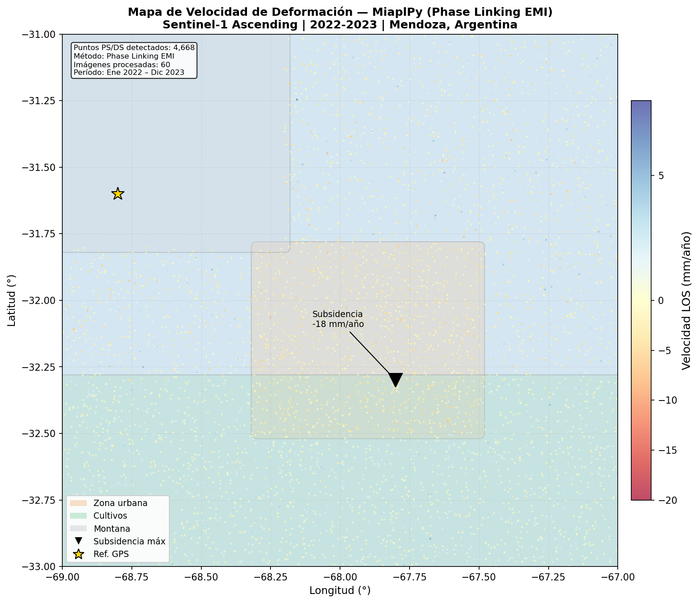
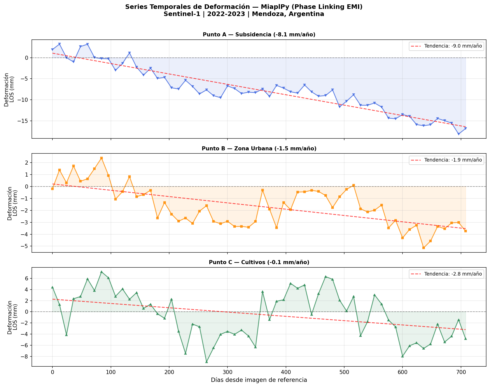
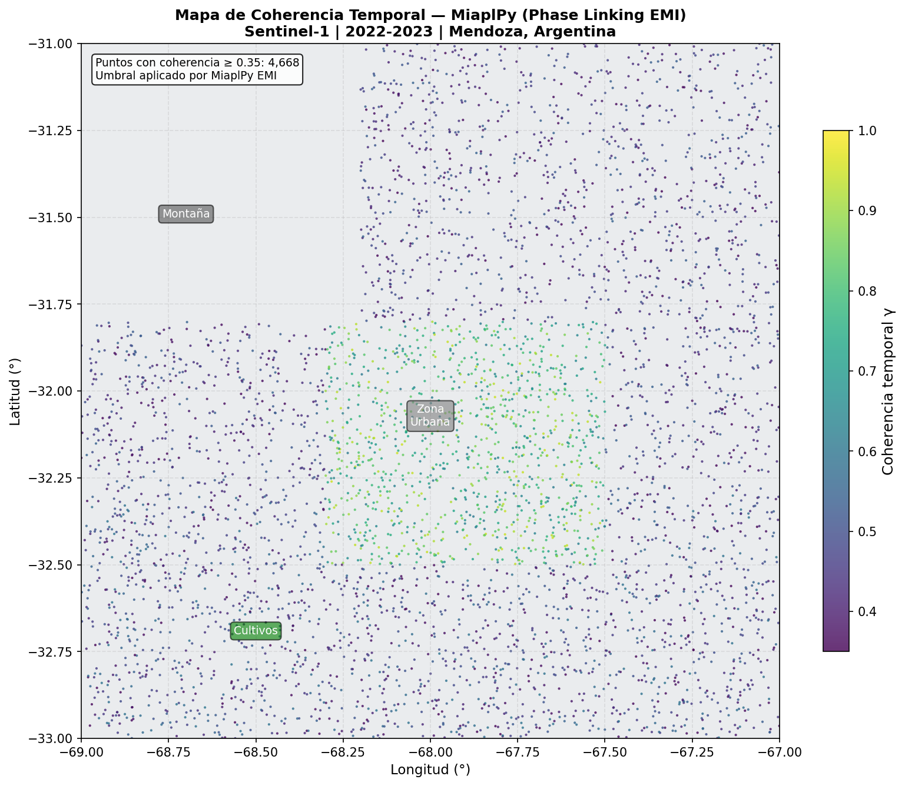

# SISAR — Ejecutor MiaplPy en Docker

Pipeline de procesamiento InSAR con MiaplPy containerizado en Docker.
Desarrollado para el proyecto SISAR (CEDIAC-UNCUYO / CONICET).

---

## Descripción

Este módulo implementa el **Agente de Procesamiento** del sistema SISAR,
específicamente el workflow **ISCE2 + MiaplPy** para generación de series
temporales de deformación a partir de imágenes Sentinel-1.

El pipeline completo realiza:
1. Verifica si las imágenes SLC ya están en el repositorio local
2. Descarga las imágenes faltantes desde ASF Vertex (NASA)
3. Descarga el DEM de Copernicus (30m) y las órbitas precisas (ESA)
4. Corre ISCE2 topsStack para corregistrar las imágenes
5. Corre MiaplPy para generar la serie temporal de deformación

---

## ¿Qué es MiaplPy y qué hace?

MiaplPy (**MI**ami **A**mi **PL**inking in **PY**thon) es una herramienta de
procesamiento InSAR basada en **Phase Linking**, un algoritmo estadístico que
mejora la estimación de fase usando todas las imágenes del stack en conjunto.

### Phase Linking — Algoritmos disponibles

| Algoritmo | Descripción | Uso recomendado |
|---|---|---|
| **EMI** | Eigenvalue Minimization of Interferograms | Producción (más preciso) |
| **EVD** | Eigenvalue Decomposition | Casos simples |
| **PTA** | Phase Triangle Algorithm | Pruebas rápidas |

### ¿Qué es LOS?

**LOS (Line Of Sight)** es la dirección en la que el satélite mira hacia la
tierra (~38° de inclinación). La deformación se mide en esa dirección, no
verticalmente:

```
        Satélite
           /
          /  ← LOS (~38°)
         /
        /
    Suelo
```

- **LOS negativo** → el suelo se aleja del satélite → generalmente subsidencia
- **LOS positivo** → el suelo se acerca al satélite → generalmente levantamiento

### ¿MiaplPy corrige errores?

**No.** MiaplPy no es un corrector, es un **estimador de fase más robusto**:

| | InSAR clásico | MiaplPy |
|---|---|---|
| Píxeles usados | Solo PS (edificios, rocas) | PS + DS (vegetación, suelo) |
| Zonas cubiertas | Urbanas | Urbanas + rurales + agrícolas |
| Ruido de fase | Mayor | Menor (estadísticamente) |
| Corrección atmosférica | No | No (la hace MintPy después) |

Las correcciones atmosféricas y de DEM las realiza **MintPy** en el paso siguiente.

### ¿Por qué la montaña tiene pocos o ningún punto?

La coherencia en zonas montañosas es baja o nula por razones físicas reales:
- **Vegetación densa** → la señal rebota diferente en cada pasada
- **Nieve y hielo** → cambia la superficie completamente entre imágenes
- **Sombra y layover** → el radar no llega o se superponen zonas
- **Pendientes fuertes** → la geometría se distorsiona

MiaplPy mejora la situación respecto al InSAR clásico, pero no puede recuperar
zonas donde directamente no hay señal coherente.

---

## Outputs del pipeline

El sistema genera tres productos principales:

| Producto | Formato | Descripción |
|---|---|---|
| Mapa de velocidad | `.png` / `.jpg` | Velocidad de deformación LOS en mm/año |
| Serie temporal | `.png` + `.csv` | Deformación acumulada por punto en el tiempo |
| Mapa de coherencia | `.png` | Calidad de la señal por píxel (0-1) |

---

## Ejemplos de resultados

> ⚠️ **ADVERTENCIA: Las siguientes imágenes son DATOS SINTÉTICOS generados
> con fines demostrativos. NO se han utilizado imágenes satelitales reales
> para esta demo. Los valores, patrones y zonas son completamente ficticios.**

### Mapa de Velocidad de Deformación



Cada punto representa un píxel PS (Persistent Scatterer) o DS (Distributed
Scatterer) detectado por MiaplPy. El color indica la velocidad de deformación:
- **Azul** → subsidencia (hundimiento)
- **Rojo** → levantamiento
- **Zonas vacías** → baja coherencia, sin datos confiables

### Serie Temporal de Deformación



Muestra la evolución temporal de la deformación en tres puntos representativos:
- **Punto A** → zona de subsidencia máxima
- **Punto B** → zona urbana estable
- **Punto C** → zona de cultivos con señal estacional

La línea roja punteada indica la tendencia lineal (velocidad promedio).

### Mapa de Coherencia Temporal



Indica la calidad de la señal radar en cada punto. Valores altos (amarillo/verde)
indican píxeles confiables. MiaplPy descarta puntos con coherencia menor a 0.35.

---

## Requisitos

- Docker Desktop instalado y corriendo
- Cuenta en [NASA Earthdata](https://urs.earthdata.nasa.gov) (gratuita)
- ~500 GB de disco disponible para datos reales
- 16 GB RAM mínimo para correr ISCE2

---

## Instalación

### 1. Clonar el repositorio

```bash
git clone https://github.com/NicoLanzarini/sisar-miaplpy.git
cd sisar-miaplpy
```

### 2. Crear el archivo de credenciales

```bash
echo "EARTHDATA_USER=tu_usuario" > .env
echo "EARTHDATA_PASS=tu_password" >> .env
```

> **IMPORTANTE**: El archivo `.env` nunca debe subirse a GitHub.
> Ya está incluido en el `.gitignore`.

### 3. Construir la imagen Docker

```bash
docker build -t sisar-execute:latest .
```

El build tarda aproximadamente 15-60 minutos. Instala ISCE2, MiaplPy, MintPy
y todas las dependencias automáticamente.

---

## Configuración

Editá el archivo `config.json` con los parámetros de tu trabajo:

```json
{
    "job_id": "nombre_del_trabajo",
    "bbox": [sur, norte, oeste, este],
    "dates": ["20230109", "20230121", "..."],
    "phase_linking_method": "EMI",
    "azimuth_looks": 5,
    "range_looks": 20
}
```

### Parámetros principales

| Parámetro | Descripción | Valores posibles |
|---|---|---|
| `bbox` | Bounding box [S, N, O, E] | coordenadas decimales |
| `dates` | Fechas a procesar | formato YYYYMMDD |
| `phase_linking_method` | Algoritmo de phase linking | EMI, EVD, PTA |
| `azimuth_looks` | Looks en azimuth | 5 (default) |
| `range_looks` | Looks en rango | 20 (default) |

---

## Uso

### Correr el pipeline completo

```bash
docker run --rm \
  --env-file .env \
  -v $(pwd)/config.json:/workspace/config.json \
  -v /ruta/a/datos:/workspace \
  sisar-execute:latest
```

### Correr scripts individuales

```bash
# Buscar fechas disponibles para una región
docker run --rm --env-file .env \
  -v $(pwd)/scripts:/workspace/scripts \
  sisar-execute:latest python /workspace/scripts/search_dates.py

# Solo descargar imágenes (modo test: 1 escena)
docker run --rm --env-file .env \
  -v $(pwd)/config.json:/workspace/config.json \
  -v /ruta/datos:/workspace/slc \
  sisar-execute:latest python /workspace/scripts/download_asf.py \
  /workspace/config.json 20230109 1

# Solo descargar DEM
docker run --rm \
  -v $(pwd)/config.json:/workspace/config.json \
  -v /ruta/datos:/workspace/dem \
  sisar-execute:latest python /workspace/scripts/download_dem.py \
  /workspace/config.json

# Generar outputs de ejemplo (datos sintéticos)
docker run --rm \
  -v $(pwd)/scripts:/workspace/scripts \
  -v $(pwd)/example_outputs:/workspace/example_outputs \
  sisar-execute:latest bash -c "cd /workspace && python scripts/generate_example_outputs.py"
```

---

## Estructura del proyecto

```
docker/
├── Dockerfile                      # Define la imagen Docker
├── environment.yml                 # Paquetes conda/pip
├── docker-compose.yml              # Orquesta contenedores
├── .env                            # Credenciales (NO subir a git)
├── .gitignore                      # Archivos excluidos de git
├── config.json                     # Parámetros del trabajo
├── entrypoint.sh                   # Script principal del pipeline
├── example_outputs/                # Imágenes de ejemplo (sintéticas)
│   ├── velocity_map.png
│   ├── timeseries.png
│   ├── coherence_map.png
│   └── timeseries.csv
└── scripts/
    ├── check_repository.py         # Verifica repo local
    ├── search_dates.py             # Busca fechas en ASF Vertex
    ├── download_asf.py             # Descarga SLCs de NASA/ASF
    ├── download_dem.py             # Descarga DEM Copernicus
    ├── download_orbits.py          # Descarga órbitas ESA
    ├── run_isce2.py                # Ejecuta ISCE2 topsStack
    ├── run_miaplpy.py              # Ejecuta MiaplPy
    └── generate_example_outputs.py # Genera demos sintéticas
```

---

## Estructura de datos esperada

```
workspace/
├── slc/            # Imágenes SLC de Sentinel-1 (.zip)
├── dem/            # DEM Copernicus (dem.tif)
├── orbits/         # Órbitas POEORB (.EOF)
├── isce2_output/   # Outputs de ISCE2
│   ├── merged/
│   │   ├── SLC/*/*.slc.full
│   │   └── geom_reference/hgt.rdr.full ...
│   ├── baselines/
│   └── reference/IW*.xml
└── series_ps/      # Outputs de MiaplPy
```

---

## Stack tecnológico

| Herramienta | Función |
|---|---|
| ISCE2 | Corregistro de SLCs (topsStack) |
| MiaplPy | Series temporales con Phase Linking |
| MintPy | Corrección atmosférica y resultados finales |
| sardem | Descarga DEM Copernicus |
| asf_search | Búsqueda y descarga desde ASF Vertex |
| snaphu | Unwrapping de fase |

---

## Estado del desarrollo

- [x] Docker build completo
- [x] Descarga de SLCs desde ASF Vertex
- [x] Descarga de DEM Copernicus
- [x] Descarga de órbitas ESA POEORB
- [x] Template de MiaplPy generado automáticamente
- [x] Outputs de ejemplo generados
- [ ] Prueba con outputs reales de ISCE2
- [ ] Script de resultados finales
- [ ] Integración con servidor SISAR

---

## Próximos pasos

1. Conseguir outputs reales de ISCE2 para probar MiaplPy
2. Ajustar paths según estructura real de ISCE2
3. Agregar script de generación de resultados finales
4. Integrar con el sistema SISAR completo

---

## Autores

Desarrollado en el marco del proyecto SISAR
CEDIAC — Universidad Nacional de Cuyo / CONICET
